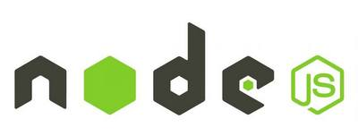
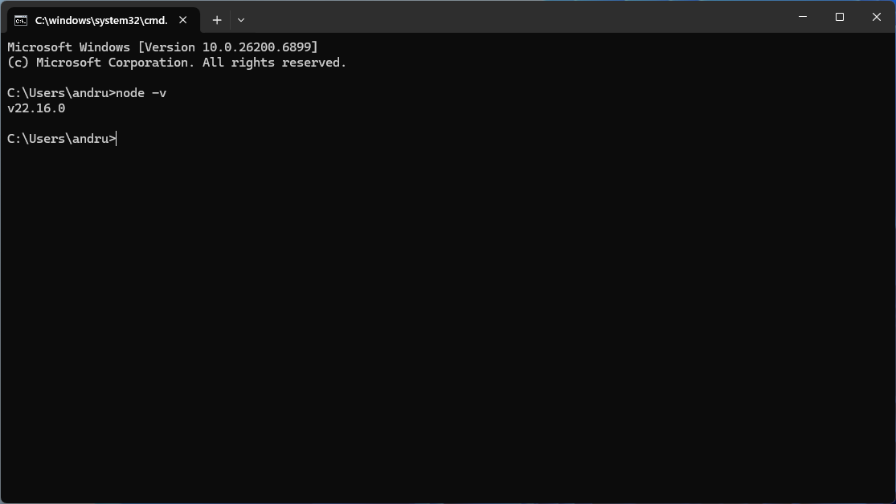

# Gulp, Node.js



[nodejs.org](https://nodejs.org) — це офіційний вебсайт Node.js, тобто середовища виконання JavaScript поза браузером. **Node.js** дозволяє запускати JavaScript не тільки у браузері (як Chrome чи Firefox), а прямо на комп’ютері або сервері.
Завдяки цьому на JavaScript можна писати не лише сайти, а й: сервери, бекенд-частину вебзастосунків, утиліти, скрипти, програми, чат-боти, навіть десктопні застосунки.

[npmjs.com](https://www.npmjs.com/) — це офіційний вебсайт платформи **npm** (Node Package Manager). Це онлайн-магазин для JavaScript-бібліотек, тільки безкоштовний.
Там зберігаються мільйони готових шматків коду — модулів, утиліт, фреймворків — які можна використовувати у своїх проєктах.

[vite.dev](https://vite.dev/) — це офіційний вебсайт інструменту **Vite** — сучасного інструменту для розробки фронтенда (build-tool + dev-сервер) для веб-додатків.

## Що таке Gulp? | Node.js

### Gulp

**Gulp** — це інструмент автоматизації завдань, який використовується у веб-розробці для виконання різноманітних рутинних операцій. Він дозволяє автоматизувати такі завдання, як мініфікація файлів CSS і JavaScript, компіляція препроцесорних файлів (наприклад, SASS у CSS), оптимізація зображень, перезавантаження браузера під час розробки тощо. Gulp використовує Node.js як платформу та npm (Node Package Manager) для управління пакетами.

Основні характеристики Gulp включають:

1. **Використання потоків (streams)**: Gulp використовує потоки Node.js для читання, трансформації та запису файлів, що може значно прискорити обробку завдань.
2. **Код на основі конфігурації**: На відміну від інших інструментів, які використовують конфігураційні файли, Gulp дозволяє визначати завдання за допомогою коду JavaScript, що надає більшу гнучкість та контроль.
3. **Екосистема плагіні**в: Є велика кількість плагінів, доступних для Gulp, які можуть бути використані для виконання майже будь-якого завдання, пов'язаного з веб-розробкою.
4. **Простота використання**: Через свій кодовий підхід та простоту API, Gulp дозволяє легко створювати та управляти складними процесами автоматизації.

Для використання Gulp потрібно встановити Node.js та npm, після чого можна встановити сам Gulp і потрібні плагіни через npm.

### Node.js

**Node.js** — це середовище виконання JavaScript, що дозволяє запускати код JavaScript на стороні сервера. Воно побудоване на базі двигуна V8 від Google Chrome, що робить його швидким та ефективним для розробки веб-додатків. Ми використовуємо Node.js не тільки для розробки серверних додатків, але й для інструментів розробки, автоматизації завдань і роботи з різноманітними утилітами через npm, систему управління пакетами, яка є інтегрованою частиною Node.js. Node.js змінює традиційний підхід до виконання JavaScript, розширюючи його можливості з браузера на загальне програмування на стороні сервера та інші сценарії використання.

#### Установка Node.js

Для роботи з **Gulp** встановлюємо **Node.js**, з офіційного сайту https://nodejs.org/en, вибираючи **LTS** версію для стабільності або поточну для останніх функцій.

**LTS** означає **"Long Term Support"**, що перекладається як "довгострокова підтримка". Це термін, який зазвичай використовується для позначення версій програмного забезпечення, які отримують оновлення безпеки та виправлення помилок протягом тривалого періоду часу, забезпечуючи стабільність і надійність для користувачів, що залежать від цього ПЗ у критично важливих середовищах.

#### Перевірка версії Node.js

Щоб перевірити версію Node.js, яку ми встановили на нашій системі, ми використовуємо команду `node -v` у командному рядку або терміналі. Ця команда виводить поточну версію Node.js, дозволяючи нам швидко визначити, яка версія програми використовується.



## Знайомство з npm та Yarn

### Що таке npm?

**npm**, або **Node Package Manager**, є системою управління пакетами для JavaScript, яка дозволяє нам легко встановлювати, ділитися та управляти залежностями (бібліотеками, інструментами тощо) у проєктах JavaScript. Вона використовується разом із Node.js для розробки веб-додатків, інструментів командного рядка, а також для роботи з іншими видами програмного забезпечення. npm складається з командного рядка (CLI) для виконання різних команд та реєстру для зберігання пакетів. Це не тільки спрощує процес додавання та оновлення бібліотек у наших проєктах, але й сприяє співпраці та обміну кодом у спільноті розробників.

### Пакети в Node.js

У контексті Node.js пакети є модулями або бібліотеками, які ми можемо встановлювати за допомогою npm (Node Package Manager) для використання у наших проєктах. Ці пакети містять код, який виконує певні функції або надає конкретну функціональність, дозволяючи нам легко додавати, оновлювати та управляти залежностями без необхідності переписувати складні частини коду вручну. Ми використовуємо пакети для оптимізації розробки, використовуючи вже існуючі рішення замість того, щоб створювати все з нуля.

### Файл package.json

Файл `package.json` є основним файлом для будь-якого проєкту на Node.js, який описує проєкт та його залежності. Він дозволяє нам визначати метаінформацію про проєкт, таку як назва, версія, автор, ліцензія, скрипти для запуску та тестування проєкту, а також залежності, які необхідні для його роботи. Цей файл використовується npm для ідентифікації проєкту та управління пакетами, що входять до складу проєкту.

Приклад простого `package.json` файла:

```json
{
  "name": "example-project",
  "version": "1.0.0",
  "description": "Приклад проєкту на Node.js",
  "main": "index.js",
  "scripts": {
    "start": "node index.js",
    "test": "echo \"Error: no test specified\" && exit 1"
  },
  "author": "Ім'я Автора",
  "license": "ISC",
  "dependencies": {
    "express": "^4.17.1"
  },
  "devDependencies": {
    "nodemon": "^2.0.4"
  }
}
```

У цьому прикладі ми визначили основну інформацію про проєкт, таку як його назва (`name`), версію (`version`), опис (`description`), головний вхідний файл (`main`), скрипти (`scripts`) для запуску та тестування проєкту. Також ми вказали автора (`author`), тип ліцензії (`license`), залежності (`dependencies`) та залежності для розробки (`devDependencies`), необхідні для роботи та розробки проєкту відповідно.

### Створення проекта з використанням npm

Для створення нового проєкту з використанням npm, ми можемо використати команду:

```cmd
npm init
```

Ця команда запускає інтерактивний процес створення файлу `package.json`. Цей процес пропонує заповнити різні поля метаінформації про проєкт, такі як назва проєкту, версія, опис, автор та інші. Це дозволяє нам контролювати параметри нашого проєкту з самого початку.

Якщо ми хочемо пропустити інтерактивне заповнення та створити `package.json` зі стандартними значеннями, ми можемо використати команду:

```cmd
npm init -y
```

Ця команда автоматично генерує файл `package.json` без додаткових запитань, використовуючи стандартні значення для всіх полів. Це корисно для швидкого старту проєкту, коли детальна настройка метаінформації проєкту на початковому етапі не є пріоритетною.

### Файл package.lock.json

Файл `package-lock.json`, який npm автоматично генерує під час встановлення або оновлення пакетів, точно фіксує версії встановлених пакетів та їх залежності. Це забезпечує однаковість залежностей у всіх середовищах, уникаючи проблем з розбіжностями у версіях і сприяючи надійності розгортання проєктів.

## Знайомство з Yarn

### Що таке Yarn?

Yarn є альтернативною системою управління пакетами для JavaScript, яка служить заміною npm. Вона була створена для того, щоб вирішити деякі проблеми, з якими ми можемо зіткнутися при використанні npm, такі як швидкість завантаження пакетів і точність їх встановлення. Yarn забезпечує більш швидке завантаження залежностей за рахунок кешування кожного завантаженого пакету та паралельного встановлення залежностей. Крім того, Yarn використовує файл `yarn.lock` для точного контролю версій пакетів, що гарантує, що проєкт, який працює на одній машині, буде працювати однаково добре на іншій машині. Yarn також пропонує зручні команди для управління пакетами та їхніми версіями.

### Створення проекта з використанням Yarn

Для створення нового проєкту з використанням Yarn, ми спочатку ініціалізуємо проєкт, створивши файл `package.json`, який міститиме метаінформацію про проєкт та його залежності. Це можна зробити за допомогою наступної команди:

```cmd
yarn init
```

Під час виконання цієї команди, Yarn задасть нам серію питань про проєкт, такі як назва проєкту, версія, опис, автор і так далі. Відповідаючи на ці питання, ми визначаємо основні параметри нашого проєкту. Це допомагає налаштувати проєкт згідно з нашими потребами.

Якщо ми хочемо автоматично створити `package.json` зі стандартними значеннями без відповідей на питання, можна використати команду:

```cmd
yarn init -y
```

Ця команда пропускає інтерактивне опитування і генерує файл `package.json` зі стандартними значеннями для швидкого старту проєкту. Після ініціалізації проєкту за допомогою однієї з цих команд, ми можемо почати додавати залежності до нашого проєкту, використовуючи команду `yarn add`, щоб встановити необхідні пакети та бібліотеки.

## dependencies vs devDependencies

У нашому проєкті на Node.js, коли ми працюємо з файлом `package.json`, ми розрізняємо два типи залежностей: `dependencies` та `devDependencies`.

`Dependencies` — це пакети, необхідні для роботи нашого додатку у виробництві, наприклад, бібліотеки, які використовуються в коді додатку безпосередньо.

З іншого боку, `devDependencies` охоплюють пакети, які необхідні тільки під час розробки та тестування, наприклад, інструменти для компіляції коду, тестові фреймворки або інструменти для форматування коду.

Розрізнення між цими двома типами залежностей дозволяє нам забезпечити, що виробниче середовище містить тільки те, що дійсно необхідно для роботи додатку, оптимізуючи його продуктивність та безпеку.

#### node_modules

`node_modules` — це директорія у наших проєктах на Node.js, де зберігаються всі локально встановлені пакети та їхні залежності. Коли ми встановлюємо пакет за допомогою npm або Yarn для конкретного проєкту, він разом із усіма своїми залежними пакетами розміщується у цій папці. Це дозволяє нашому проєкту ізолювати свої залежності від інших проєктів, що забезпечує консистентність та надійність в роботі.

## Глобальні пакети

### Що таке глобальні пакети?

**Глобальні пакети** в Node.js — це пакети, які ми встановлюємо один раз на системному рівні через npm або Yarn і які стають доступними з будь-якого місця в системі.

Це означає, що ми можемо використовувати їх як команди в терміналі або командному рядку, незалежно від того, в якій директорії ми знаходимося. Глобальні пакети зазвичай включають різні інструменти для розробки, такі як фреймворки для створення додатків, утиліти для тестування або автоматизації завдань.

Встановлення пакетів глобально допомагає нам мати швидкий доступ до них для виконання загальних завдань або створення проєктів, не включаючи ці пакети до кожного окремого проєкту.

#### gulp-cli

Для того, щоб використовувати Gulp у наших проєктах, ми спочатку встановлюємо `gulp-cli` глобально в нашій системі за допомогою команди:

```cmd
npm install --global gulp-cli
```

`gulp-cli` є командним інтерфейсом для Gulp, який дозволяє нам виконувати завдання Gulp з командного рядка незалежно від місця в системі.

Встановлення `gulp-cli` глобально гарантує, що ми можемо легко почати працювати з Gulp в будь-якому проєкті, використовуючи прості команди для запуску визначених завдань, таких як мініфікація файлів, компіляція препроцесорів або автоматичне оновлення браузера. Це спрощує процес налаштування та використання Gulp, роблячи розробку ефективнішою та приємнішою.

## Локальні пакети

### Що таке локальні пакети?

**Локальні пакети в Node.js** — це пакети, які ми встановлюємо безпосередньо у конкретний проєкт за допомогою npm або Yarn. Вони зберігаються у директорії `node_modules` всередині проєкту та вказуються у файлі `package.json` у розділах `dependencies` або `devDependencies`, залежно від їхнього призначення.

Встановлення пакетів локально дозволяє нам контролювати версії залежностей для кожного проєкту окремо, забезпечуючи консистентність та надійність роботи додатків. Це також спрощує процес спільної роботи та розгортання проєктів, оскільки всі необхідні залежності визначені та легко встановлюються на будь-якій машині за допомогою команди `npm install` або `yarn install`.

### Установка gulp локально

**Плагін gulp** - це інструмент автоматизації завдань, який допомагає в автоматизації рутинних процесів розробки.

Для встановлення gulp локально у наш проєкт, ми можемо використовувати одну з наступних команд:

```cmd
npm install --save-dev gulp
```

Або скорочена версія:

```cmd
npm i -D gulp
```

Ця команда додає Gulp як залежність для розробки (`devDependency`) у наш файл `package.json`. Це означає, що Gulp буде використовуватися тільки під час розробки проєкту, наприклад, для автоматизації задач, таких як мініфікація коду або компіляція препроцесорів, але не потрібен у виробничому середовищі.

Альтернативно, якщо ми використовуємо Yarn, можемо встановити Gulp за допомогою команди:

```cmd
yarn add -D gulp
```

Обидва підходи забезпечують, що Gulp додається до списку залежностей для розробки у `package.json`, забезпечуючи легке встановлення та управління версіями для всіх, хто працює над проєктом.

### gulp-sass

Для обробки SCSS файлів ми використовуємо пакет `gulp-sass`.

Встановлення через npm:

```cmd
npm install --save-dev gulp-sass
```

Встановлення через yarn:

```cmd
yarn add -D gulp-sass
```

Після встановлення ми підключаємо `gulp-sass` у нашому проєкті. Це робиться за допомогою вимоги до модуля `gulp-sass` та передачі модулю `sass` як аргументу, таким чином: `const sass = require('gulp-sass')(require('sass'))`. Це дозволяє нам використовувати `sass` у наших Gulp завданнях для компіляції SCSS файлів у CSS, підвищуючи ефективність і зручність нашого процесу розробки.

```js
const { task, series, parallel, src, dest, watch } = require('gulp')
const sass = require('gulp-sass')(require('sass'))

function scss() {
  return src('./assets/scss/style.scss')
    .pipe(sass().on('error', sass.logError))
    .pipe(dest('./assets/css'))
}

task('scss', scss)
```

Цей код демонструє, як встановити `gulp-sass` та використовувати його для компіляції SCSS файлів у CSS, що є частою задачею у розробці веб-проєктів.

### browser-sync

Для забезпечення синхронізації між браузерами та автоматичного оновлення сторінки при розробці веб-проєктів ми використовуємо `browser-sync`. Цей інструмент дозволяє нам тестувати наші проєкти в реальному часі на різних пристроях, що значно покращує ефективність розробки.

Встановлення через npm:

```cmd
npm install --save-dev browser-sync
```

Встановлення через yarn:

```cmd
yarn add -D browser-sync
```

Після встановлення ми підключаємо `browser-sync` у нашому проєкті, створюючи екземпляр цього інструменту. Це дає нам можливість використовувати його функції для створення локального сервера, який може автоматично перезавантажувати сторінку або інжектувати стилі без перезавантаження при зміні файлів. Підключення виглядає так:

```js
const browserSync = require('browser-sync').create();

function scss () {  
  ...
  .pipe(browserSync.stream());
}

function syncInit () {
  browserSync.init({
      server: {
          baseDir: './'
      }
  });
}

async function sync() {
  browserSync.reload()
}

function watchFiles() {
  syncInit()
  watch('./assets/scss/**/*.scss', scss)
  watch('./*.html', sync)
  watch('./assets/js/**/*.js', sync)
}
```

Цей код демонструє, як підключити `browser-sync` до проєкту та готуватися до його використання для покращення процесу розробки за допомогою автоматичного оновлення сторінок і синхронізації між браузерами.

### gulp-rename, cssnano, gulp-postcss

Для покращення процесу розробки веб-проєктів ми використовуємо набір інструментів, які дозволяють оптимізувати та перейменувати CSS файли. В цьому контексті ми додаємо до нашого проєкту пакети `gulp-rename`, `cssnano`, та `gulp-postcss`.

`gulp-rename` допомагає нам перейменувати вихідні файли, що забезпечує гнучкість у управлінні асетами.

`cssnano` є плагіном для оптимізації CSS, який зменшує розмір файлів за допомогою мініфікації.

`gulp-postcss` дозволяє нам використовувати різноманітні PostCSS плагіни в рамках нашого Gulp потоку, що підвищує ефективність та гнучкість обробки стилів.

Для одночасного встановлення всіх трьох пакетів:

```cmd
npm i -D gulp-rename cssnano gulp-postcss
```

Підключаємо плагіни до конфігураційного файлу:

```js
const cssnano = require('cssnano')
const rename = require('gulp-rename')
const postcss = require('gulp-postcss')

const plugins = [cssnano({ preset: 'default' })]

function scssMin() {
  return src('./assets/scss/style.scss')
    .pipe(sass().on('error', sass.logError))
    .pipe(postcss(plugins))
    .pipe(rename({ suffix: '.min' }))
    .pipe(dest('./assets/css'))
}

task('min', scssMin)
```

Ці інструменти є частиною нашого інструментарію для розробки, що дозволяє нам ефективно працювати з CSS, оптимізувати стилі для продакшну та забезпечити більш ефективний процес розробки.

### gulp-csscomb

Плагін `gulp-csscomb` форматує CSS-код, роблячи його більш консистентним і читабельним. Для встановлення `gulp-csscomb` ми використовуємо наступні команди:

Встановлення через npm:

```cmd
npm install --save-dev gulp-csscomb
```

Встановлення через yarn:

```cmd
yarn add -D gulp-csscomb
```

Після встановлення плагіна, ми підключаємо його до нашого проєкту:

```js
const csscomb = require('gulp-csscomb')

function comb() {
  return src('./assets/scss/**/*.scss')
    .pipe(csscomb('./.csscomb.json'))
    .pipe(dest('./assets/scss'))
}

task('comb', comb)
```

Це дозволяє нам використовувати `gulp-csscomb` для форматування CSS файлів, підвищуючи якість та консистентність нашого коду

### autoprefixer

Для автоматичного додавання вендорних префіксів до CSS, ми користуємося `autoprefixer`. Це забезпечує кращу сумісність нашого CSS коду з різними браузерами, автоматично додаючи необхідні префікси до CSS властивостей згідно з даними Can I Use.

Встановлення через npm:

```cmd
npm install --save-dev autoprefixer
```

Встановлення через yarn:

```cmd
yarn add -D autoprefixer
```

Після встановлення плагіна, ми підключаємо його до нашого проєкту:

```js
const autoprefixer = require('autoprefixer');

const PLUGINS = [
  autoprefixer({
    overrideBrowserslist: ['last 5 versions'],
    cascade: true
  })
];

function scss () {
  ...
  .pipe(postcss(PLUGINS))
  ...
}
function scssMin () {
  const pluginsExtended = PLUGINS.concat([cssnano({
      preset: 'default'
  })]);
  return src('./assets/scss/style.scss')...
}
```

Цей підхід дозволяє нам забезпечити більшу універсальність і зручність у підтримці коду, а також підвищує продуктивність розробки, зменшуючи необхідність вручну додавати префікси.

### sourcemaps
Підтримка sourcemaps вбудована безпосередньо в методи `src()` і `dest()` Gulp, що робить процес створення та управління sourcemaps набагато простішим і ефективнішим. Ця функціональність дозволяє нам відстежувати наші вихідні файли, такі як SCSS або JavaScript, назад до оригінального коду після обробки, що є важливим для налагодження.

Щоб активувати вбудовану підтримку sourcemaps, нам необхідно виконати наступне:

При використанні `src()` для зчитування файлів, ми можемо включити sourcemaps, передавши опцію `{sourcemaps: true}`:

```js
src('src-path', { sourcemaps: true })
  .pipe(...)
```

Це дозволяє нам ініціювати створення sourcemaps прямо на етапі читання файлів. Далі, при записі файлів за допомогою `dest()`, ми також можемо вказати, як має бути оброблено sourcemaps:

Для вбудовування sourcemaps безпосередньо в код CSS або JavaScript файлу, використовуємо:

```js
.pipe(dest('dest-path', { sourcemaps: true }))
```

Якщо ж нам потрібно створити зовнішній sourcemaps файл, ми використовуємо:

```js
.pipe(dest('dest-path', { sourcemaps: '.' }))
```

Цей підхід значно спрощує роботу з sourcemaps, оскільки нам більше не потрібно використовувати додаткові плагіни для їх генерації та управління. Вбудована підтримка дозволяє нам ефективніше налагоджувати наш код, забезпечуючи точне відображення відносин між вихідними та обробленими файлами.

### css-mqpacker, sort-css-media-queries

Ми використовуємо плагіни `css-mqpacker` та `sort-css-media-queries` для оптимізації та впорядкування медіа-запитів у наших CSS-файлах.

`css-mqpacker` дозволяє нам об'єднувати декілька медіа-запитів з однаковими параметрами в один, зменшуючи розмір кінцевого CSS-файлу та покращуючи його читабельність.

`sort-css-media-queries` є інструментом для сортування медіа-запитів, що допомагає впорядкувати їх логічно для підвищення ефективності стилів.

Для установки цих плагінів ми використовуємо наступні команди:

Встановлення через npm:

```cmd
npm install --save-dev css-mqpacker sort-css-media-queries
```

Встановлення через yarn:

```cmd
yarn add -D css-mqpacker sort-css-media-queries
```

Після встановлення плагіна, ми підключаємо його до нашого проєкту:

```js
const mqpacker = require('css-mqpacker')
const sortCSSmq = require('sort-css-media-queries')

const PLUGINS = [
  autoprefixer({
    overrideBrowserslist: ['last 5 versions'],
    cascade: true
  }),
  mqpacker({ sort: sortCSSmq })
]
```

Ці інструменти відіграють ключову роль у нашій розробці, дозволяючи нам оптимізувати стилі для кращої продуктивності та сумісності між різними пристроями та розмірами екрану.

### gulp-pug

Плагін `gulp-pug` дозволяє компілювати Pug (раніше відомий як Jade) шаблони в HTML, полегшуючи процес розробки HTML-сторінок.

Встановлення через npm:

```cmd
npm install --save-dev gulp-pug
```

Встановлення через yarn:

```cmd
yarn add -D gulp-pug
```

Нижче наведено приклад використання gulp-pug у проєкті:

```js
const pug = require('gulp-pug');

function compilePug() {
  return src(PATH.pugRootFile)
    .pipe(pug({ pretty: true }))
    .pipe(dest(PATH.pugFolder));
}
```

Цей приклад демонструє, як ми можемо створити задачу в Gulp для компіляції файлів `.pug` у `.html`, використовуючи плагін `gulp-pug`. Ми визначаємо вхідний шлях, де знаходяться наші Pug файли, використовуємо плагін для їх компіляції, встановлюємо опцію `pretty` для кращої читабельності вихідного коду, та вказуємо кінцевий шлях для збереження результату компіляції.

## gulpfile.js з поясненнями
Цей код налаштовує середовище розробки для веб-проєкту, використовуючи Gulp. Він компілює SCSS у CSS, мінімізує CSS файли, компілює Pug шаблони в HTML, автоматично оновлює браузер при зміні файлів, та оптимізує стилі CSS за допомогою різних плагінів.

```js
// Імпорт необхідних функцій і плагінів з Gulp та інших бібліотек
const { src, dest, watch, task, series, parallel } = require('gulp');
const sass = require('gulp-sass')(require('sass'));
const browserSync = require('browser-sync').create();
const cssnano = require('cssnano');
const rename = require('gulp-rename');
const postcss = require('gulp-postcss');
const csscomb = require('gulp-csscomb');
const autoprefixer = require('autoprefixer');
const mqpacker = require('css-mqpacker');
const sortCSSmq = require('sort-css-media-queries');
const pug = require('gulp-pug');

// Об'єкт із шляхами до файлів проєкту для легкого доступу та управління
const PATH = {
  scssRootFile: './assets/scss/style.scss', // Основний SCSS файл
  scssAllFiles: './assets/scss/**/*.scss', // Всі SCSS файли для спостереження
  scssFolder: './assets/scss/', // Папка з SCSS файлами
  cssFolder: './assets/css/', // Папка для скомпільованих CSS файлів
  htmlFolder: './', // Папка для HTML файлів
  htmlAllFiles: './*.html', // Всі HTML файли для спостереження
  jsFolder: './assets/js/', // Папка з JS файлами
  jsAllFiles: './assets/js/**/*.js', // Всі JS файли для спостереження
  pugAllFiles: './*.pug', // Всі Pug файли для спостереження
  pugFolder: './templates/', // Папка для компільованих Pug файлів
  pugRootFile: './index.pug' // Основний Pug файл
};

// Масив плагінів PostCSS для використання у задачах
const PLUGINS = [
  autoprefixer({ // Автоматично додає вендорні префікси до CSS
    overrideBrowserslist: ['last 5 versions'],
    cascade: true
  }),
  mqpacker({ sort: sortCSSmq }) // Групує та сортує медіа-запити
];

// Функція для компіляції SCSS у CSS
function compileScss() {
  return src(PATH.scssRootFile) // Вихідний файл
    .pipe(sass().on('error', sass.logError)) // Компіляція SASS у CSS із обробкою помилок
    .pipe(postcss(PLUGINS)) // Застосування плагінів PostCSS
    .pipe(csscomb()) // Форматування CSS коду
    .pipe(dest(PATH.cssFolder)) // Зберігання результату у вказану папку
    .pipe(browserSync.stream()); // Оновлення потоку BrowserSync для гарячого перезавантаження
}

// Функція для розробницької компіляції SCSS у CSS із source maps
function compileScssDev() {
  const pluginsForDevMode = [...PLUGINS]; // Копіювання масиву плагінів

  pluginsForDevMode.splice(0, 1); // Видалення autoprefixer з масиву плагінів для розробки

  return src(PATH.scssRootFile, { sourcemaps: true }) // Включення source maps
    .pipe(sass().on('error', sass.logError)) // Компіляція SASS у CSS із обробкою помилок
    .pipe(postcss(pluginsForDevMode)) // Застосування плагінів PostCSS без autoprefixer
    .pipe(dest(PATH.cssFolder, { sourcemaps: true })) // Зберігання результату з source maps
    .pipe(browserSync.stream()); // Оновлення потоку BrowserSync
}

// Функція для компіляції та мініфікації SCSS у CSS
function compileScssMin() {
  const pluginsForMinify = [...PLUGINS, cssnano({ preset: 'default' })]; // Додавання cssnano для мініфікації

  return src(PATH.scssRootFile)
    .pipe(sass().on('error', sass.logError)) // Компіляція SASS у CSS із обробкою помилок
    .pipe(postcss(pluginsForMinify)) // Застосування плагінів PostCSS включно із мініфікацією
    .pipe(rename({ suffix: '.min' })) // Додавання суфіксу .min до імені файлу
    .pipe(dest(PATH.cssFolder)); // Зберігання мініфікованого файлу
}

// Функція для форматування SCSS файлів за допомогою csscomb
function comb() {
  return src(PATH.scssAllFiles) // Всі SCSS файли для обробки
    .pipe(csscomb()) // Застосування csscomb для форматування
    .pipe(dest(PATH.scssFolder)); // Зберігання відформатованих файлів
}

// Функція для компіляції Pug файлів у HTML
function compilePug() {
  return src(PATH.pugRootFile) // Основний Pug файл
    .pipe(pug({ pretty: true })) // Компіляція у HTML з форматуванням
    .pipe(dest(PATH.pugFolder)); // Зберігання скомпільованих HTML файлів
}

// Функція для ініціалізації BrowserSync
function syncInit() {
  browserSync.init({ // Налаштування сервера
    server: {
      baseDir: './' // Базова директорія для сервера
    }
  });
}

// Асинхронна функція для оновлення BrowserSync
async function sync() {
  browserSync.reload();
}

// Функція для спостереження за змінами у файлах
function watchFiles() {
  syncInit(); // Ініціалізація BrowserSync
  watch(PATH.scssAllFiles, series(compileScss, compileScssMin)); // Спостереження за SCSS файлами
  watch(PATH.htmlAllFiles, sync); // Спостереження за HTML файлами
  watch(PATH.jsAllFiles, sync); // Спостереження за JS файлами
}

// Реєстрація задач Gulp
task('pug', compilePug);
task('dev', compileScssDev);
task('min', compileScssMin);
task('scss', series(compileScss, compileScssMin));
task('comb', comb);
task('watch', watchFiles);
```

Цей код містить задачі для компіляції SCSS у CSS, мінімізації CSS, компіляції Pug у HTML, автоматичного оновлення браузера при змінах у файлах, та оптимізації CSS за допомогою різних плагінів. Він дозволяє легко керувати стилями, HTML та автоматизувати рутинні процеси розробки, спрощуючи процес створення веб-проєктів.

## Приклад проекта з використанням Gulp

📂 [gulp-example](./gulp-example.zip)
